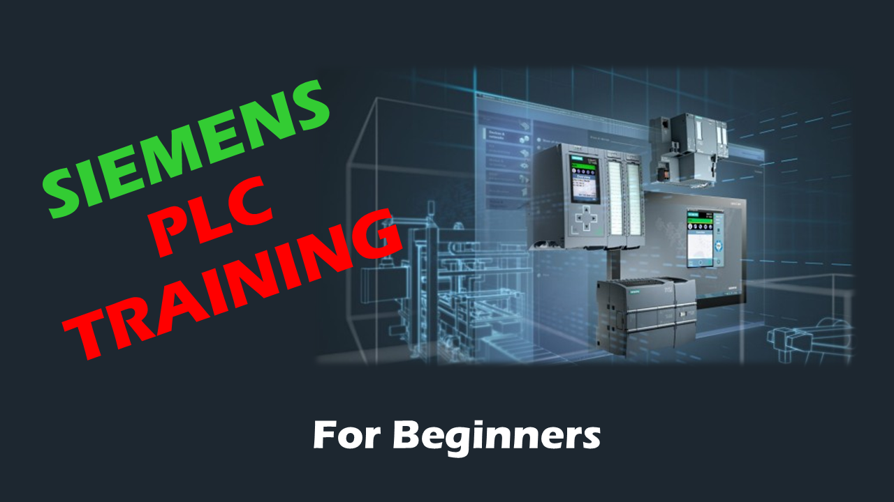

# 💻 PLC Training - For Beginners

> 🎓 Welcome to the official repository for the **PLC Training Program**, delivered under the mentorship of the **Oluwasedago Foundation**. This comprehensive course is designed to take you from foundational logic concepts to advanced hardware integration using the Siemens TIA Portal ecosystem.

---

## 📋 Table of Contents

- [Meet the Trainer](#-meet-the-trainer)
- [Course Overview](#-course-overview)
- [Course Roadmap](#-course-roadmap)
- [Repository Structure](#-repository-structure)
- [Getting Started](#-getting-started)
- [Prerequisites](#-prerequisites)
- [Learning Path](#-learning-path)
- [Resources](#-resources)
- [Contribution & Support](#-contribution--support)
- [License](#-license.txt)

---

## 🙋🏼‍♂️ Meet the Trainer

| | |
|---|---|
| **Course Lead** | [Popoola David](https://www.linkedin.com/in/Oluwasedago/) |
| **Role** | Automation Engineer & Mentor at Oluwasedago Foundation |
| **LinkedIn** | [linkedin.com/in/Oluwasedago](https://www.linkedin.com/in/Oluwasedago/) |
| **𝕏 (Twitter)** | [@Oluwasedago](https://www.x.com/oluwasedago) |

---

## 🎯 Course Overview

This training program provides a structured approach to learning PLC programming with Siemens controllers. By the end of this course, you will be able to:

- [x] Understand PLC fundamentals and industrial control systems
- [x] Install and configure TIA Portal engineering environment
- [x] Work with S7-1200/1500 hardware architectures
- [x] Configure hardware and network settings
- [x] Simulate PLC programs without physical hardware
- [x] Manage tags, data types, and memory
- [x] Program in Ladder Logic (LAD) and SCL
- [x] Implement timers and counters for automation
- [x] Utilize libraries and integrate third-party devices

---

## 📖 Course Roadmap

This training is structured into **nine core chapters**. Each directory contains specific documentation, code samples, and technical guides.

### Chapter Overview

| Chapter | Title | Description |
|:-------:|-------|-------------|
| 1 | [Introduction to PLC](./1_Introduction/) | Fundamentals of Industrial Control, History of PLCs, IEC 61131-3 |
| 2 | [TIA Portal Installation](./2_TIA_Portal_Installation/) | Engineering environment setup, software requirements, licensing |
| 3 | [PLC Hardware](./3_PLC_Hardware/) | S7-1200/1500 architectures, signal modules, industrial wiring |
| 4 | [Hardware Configuration](./4_Hardware_Configuration/) | Digital twin building, IP addressing, CPU optimization |
| 5 | [PLC Simulation](./5_PLC_Simulation/) | S7-PLCSIM testing, virtual monitoring |
| 6 | [Tags and Data Types](./6_Tags_and_Data_Types/) | Memory management, standard data types, naming conventions |
| 7 | [PLC Programming](./7_PLC_Programming/) | Ladder Logic (LAD) and Structured Control Language (SCL) |
| 8 | [Timers and Counters](./8_Timers_and_Counters/) | Time-delay operations, event-based counting |
| 9 | [Libraries and GSD Files](./9_Libraries_and_GSD_Files/) | Global Libraries, GSDML integration |

---

### 📘 Chapter 1: Introduction to PLC

*Fundamentals of Industrial Control, the History of PLCs, and the IEC 61131-3 standard.*

**Topics Covered:**
- What is a PLC?
- Evolution from relay-based systems
- PLC vs DCS vs PAC
- IEC 61131-3 programming languages
- Industrial applications overview

---

### 📘 Chapter 2: TIA Portal Installation

*Setting up your engineering environment, software requirements, and license management.*

**Topics Covered:**
- System requirements
- TIA Portal editions comparison
- Step-by-step installation guide
- License activation and management
- Software updates and patches

---

### 📘 Chapter 3: PLC Hardware and Supporting Modules

*Understanding S7-1200/1500 architectures, signal modules, and industrial wiring.*

**Topics Covered:**
- CPU specifications (S7-1200 vs S7-1500)
- Digital and analog I/O modules
- Communication modules
- Power supply considerations
- Industrial wiring best practices

#### Hardware Comparison

| Feature | S7-1200 | S7-1500 |
|---------|---------|---------|
| Target Application | Compact machines | High-performance systems |
| Processing Speed | Standard | High-speed |
| Memory | Up to 150 KB | Up to 10 MB |
| I/O Expansion | Up to 8 modules | Up to 32 modules |
| Motion Control | Basic | Advanced |

---

### 📘 Chapter 4: TIA Portal Hardware Configuration

*Building the digital twin of your system, IP addressing, and CPU property optimization.*

**Topics Covered:**
- Creating a new project
- Adding hardware to the rack
- Configuring CPU properties
- Network topology setup
- IP addressing schemes

---

### 📘 Chapter 5: PLC Simulation

*Testing logic without hardware using S7-PLCSIM and virtual monitoring.*

**Topics Covered:**
- Introduction to S7-PLCSIM
- Starting a simulation instance
- Monitoring variables online
- Forcing I/O values
- Debugging techniques

---

### 📘 Chapter 6: PLC Tags and Data Types

*Memory management, standard data types (INT, REAL, BOOL), and tag naming conventions.*

**Topics Covered:**
- PLC tag tables
- Standard data types
- User-defined data types (UDT)
- Tag naming conventions
- Memory addressing

#### Standard Data Types

| Data Type | Size | Range | Example |
|-----------|------|-------|---------|
| BOOL | 1 bit | TRUE/FALSE | Sensor_Input |
| BYTE | 8 bits | 0 to 255 | Status_Byte |
| INT | 16 bits | -32768 to 32767 | Temperature |
| DINT | 32 bits | -2³¹ to 2³¹-1 | Counter_Value |
| REAL | 32 bits | ±3.4E+38 | Pressure_Value |
| TIME | 32 bits | T#0ms to T#24d | Delay_Time |
| STRING | Variable | Up to 254 chars | Recipe_Name |

---

### 📘 Chapter 7: PLC Programming

*Hands-on logic development using Ladder Logic (LAD) and Structured Control Language (SCL).*

**Topics Covered:**
- Organization blocks (OB1, OB100, etc.)
- Function blocks (FB) and Functions (FC)
- Data blocks (DB)
- Ladder Logic fundamentals
- SCL programming basics
- Program structure best practices

#### Programming Languages Comparison

| Language | Type | Best For |
|----------|------|----------|
| LAD | Graphical | Discrete logic, maintenance-friendly |
| FBD | Graphical | Complex boolean operations |
| SCL | Textual | Algorithms, data manipulation |
| STL | Textual | Low-level optimization |
| GRAPH | Graphical | Sequential control |

---

### 📘 Chapter 8: Introduction to Timers and Counters

*Mastering time-delay operations and event-based counting for production lines.*

**Topics Covered:**
- TON (On-Delay Timer)
- TOF (Off-Delay Timer)
- TP (Pulse Timer)
- CTU (Count Up)
- CTD (Count Down)
- CTUD (Count Up/Down)

#### Timer Function Blocks

    ┌─────────────────────────────────────────────────────────┐
    │                    TON (On-Delay Timer)                 │
    ├─────────────────────────────────────────────────────────┤
    │                                                         │
    │   IN ──────┐                    ┌────────── Q           │
    │            │                    │                       │
    │   PT ──────┼──►  [TON]  ───────►├────────── ET          │
    │            │                    │                       │
    │            └────────────────────┘                       │
    │                                                         │
    │   IN:  Start input                                      │
    │   PT:  Preset time                                      │
    │   Q:   Output (TRUE after PT elapsed)                   │
    │   ET:  Elapsed time                                     │
    │                                                         │
    └─────────────────────────────────────────────────────────┘

---

### 📘 Chapter 9: Libraries and GSD Files

*Standardizing code with Global Libraries and integrating 3rd-party hardware via GSDML.*

**Topics Covered:**
- Creating global libraries
- Library types and versioning
- Importing/exporting library elements
- GSD/GSDML file structure
- Adding third-party PROFINET devices

---

## 📁 Repository Structure

    plc-training/
    ├── README.md
    ├── 0_Resources/
    │   ├── Playlist_Thumbnail.png
    │   ├── Cheat_Sheets/
    │   └── Reference_Guides/
    ├── 1_Introduction/
    │   ├── README.md
    │   └── Slides/
    ├── 2_TIA_Portal_Installation/
    │   ├── README.md
    │   ├── Installation_Guide.pdf
    │   └── Screenshots/
    ├── 3_PLC_Hardware/
    │   ├── README.md
    │   ├── Wiring_Diagrams/
    │   └── Datasheets/
    ├── 4_Hardware_Configuration/
    │   ├── README.md
    │   └── Project_Files/
    ├── 5_PLC_Simulation/
    │   ├── README.md
    │   └── Simulation_Exercises/
    ├── 6_Tags_and_Data_Types/
    │   ├── README.md
    │   └── Tag_Templates/
    ├── 7_PLC_Programming/
    │   ├── README.md
    │   ├── LAD_Examples/
    │   ├── SCL_Examples/
    │   └── Project_Files/
    ├── 8_Timers_and_Counters/
    │   ├── README.md
    │   └── Practice_Exercises/
    └── 9_Libraries_and_GSD_Files/
        ├── README.md
        ├── Sample_Libraries/
        └── GSD_Files/

---

## 🚀 Getting Started

### Step 1: Watch the Lectures

Follow the [PLC Training Playlist](https://www.youtube.com/playlist?list=PLFJaTiahcrM8lWGpyX2EzdxqexAtJTG9T) on YouTube for comprehensive video tutorials.

### Step 2: Clone the Repository

    git clone https://github.com/oluwasedago/plc-training.git
    cd plc-training

### Step 3: Install Required Software

Ensure you have **TIA Portal V16 or higher** installed to open the `.zap` (compressed) project files.

### Step 4: Follow Along

Open the corresponding chapter folder and work through the exercises alongside the video content.

---

## 📋 Prerequisites

### Software Requirements

| Software | Version | Required |
|----------|---------|:--------:|
| TIA Portal | V20+ | ✅ |
| S7-PLCSIM | V20+ | ✅ |
| Windows | 10/11 (64-bit) | ✅ |
| STEP 7 Safety | Latest | ⬜ Optional |

### Hardware Requirements (Optional)

| Component | Description |
|-----------|-------------|
| S7-1200 CPU | 1212C/1214C/1215C |
| Signal Modules | DI/DO/AI/AO as needed |
| HMI Panel | KTP400/KTP700 (optional) |
| Power Supply | 24V DC |

### Recommended Background

- [ ] Basic electrical knowledge
- [ ] Understanding of digital logic (AND, OR, NOT)
- [ ] Familiarity with industrial processes (helpful but not required)

---

## 📚 Learning Path

    ┌─────────────────────────────────────────────────────────────┐
    │                    RECOMMENDED LEARNING PATH                │
    └─────────────────────────────────────────────────────────────┘
                                  │
                                  ▼
                    ┌─────────────────────────┐
                    │   Chapter 1: Introduction│
                    │      (Foundation)        │
                    └────────────┬────────────┘
                                 │
                                 ▼
                    ┌─────────────────────────┐
                    │  Chapter 2: Installation │
                    │    (Environment Setup)   │
                    └────────────┬────────────┘
                                 │
                                 ▼
              ┌──────────────────┴──────────────────┐
              │                                     │
              ▼                                     ▼
    ┌─────────────────┐                   ┌─────────────────┐
    │ Chapter 3:      │                   │ Chapter 4:      │
    │ Hardware        │◄─────────────────►│ Configuration   │
    └────────┬────────┘                   └────────┬────────┘
             │                                     │
             └──────────────────┬──────────────────┘
                                │
                                ▼
                    ┌─────────────────────────┐
                    │  Chapter 5: Simulation   │
                    │    (Virtual Testing)     │
                    └────────────┬────────────┘
                                 │
                                 ▼
                    ┌─────────────────────────┐
                    │ Chapter 6: Tags & Data   │
                    │   (Memory Management)    │
                    └────────────┬────────────┘
                                 │
                                 ▼
                    ┌─────────────────────────┐
                    │ Chapter 7: Programming   │
                    │    (LAD & SCL)           │
                    └────────────┬────────────┘
                                 │
                                 ▼
                    ┌─────────────────────────┐
                    │ Chapter 8: Timers &      │
                    │      Counters            │
                    └────────────┬────────────┘
                                 │
                                 ▼
                    ┌─────────────────────────┐
                    │ Chapter 9: Libraries &   │
                    │      GSD Files           │
                    └────────────┬────────────┘
                                 │
                                 ▼
                         🎓 COMPLETION

---

## 📚 Resources

### Official Documentation

- [Siemens Industry Support](https://support.industry.siemens.com/)
- [TIA Portal Help Documentation](https://support.industry.siemens.com/cs/document/109784440/)
- [S7-1200 System Manual](https://support.industry.siemens.com/cs/document/109797277/)

### Additional Learning

- [IEC 61131-3 Standard Overview](https://www.plcopen.org/iec-61131-3)
- [PLCopen Technical Specifications](https://www.plcopen.org/)

### Community

- [Siemens Support Forum](https://support.industry.siemens.com/tf/)
- [PLC Talk Forums](https://www.plctalk.net/)
- [Reddit r/PLC](https://www.reddit.com/r/PLC/)

---

## 🤝 Contribution & Support

Feedback is vital for continuous improvement in the automation community. If you find a typo, a broken link, or have a technical suggestion:

### How to Contribute

1. **Fork** the repository
2. **Create** your feature branch
   
        git checkout -b feature/improvement

3. **Commit** your changes
   
        git commit -m "Add: description of changes"

4. **Push** to the branch
   
        git push origin feature/improvement

5. **Submit** a Pull Request

### Alternative Support

- 💬 Leave a comment on the relevant [YouTube video](https://www.youtube.com/@Oluwasedago)
- 📧 Contact via [LinkedIn](https://www.linkedin.com/in/Oluwasedago/)
- 🐦 Tweet [@Oluwasedago](https://www.x.com/oluwasedago)

---

## ✅ Course Completion Checklist

Track your progress through the course:

- [ ] Chapter 1: Introduction to PLC
- [ ] Chapter 2: TIA Portal Installation
- [ ] Chapter 3: PLC Hardware and Supporting Modules
- [ ] Chapter 4: TIA Portal Hardware Configuration
- [ ] Chapter 5: PLC Simulation
- [ ] Chapter 6: PLC Tags and Data Types
- [ ] Chapter 7: PLC Programming
- [ ] Chapter 8: Introduction to Timers and Counters
- [ ] Chapter 9: Libraries and GSD Files
- [ ] Final Project Completed

---

## 📄 License

This project is licensed under the MIT License - see the [LICENSE](LICENSE.txt) file for details.

---

## 🌟 Acknowledgments

- **Oluwasedago Foundation** - For supporting this educational initiative
- **Siemens** - For the TIA Portal ecosystem
- **Community Contributors** - For feedback and improvements

---

  <i>"In automation, we don't just write code; we build the future of manufacturing."</i>

  Made with ⚡ by <a href="https://www.linkedin.com/in/Oluwasedago/">Popoola David</a> | Oluwasedago Foundation

  

